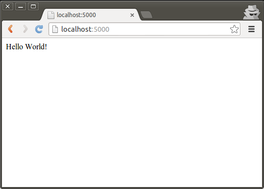

---

layout: ots
title: Hello World

---

Now that we have Python and Flask installed it's time to start with our first website. But first it helps to know a little about how your web browser retrieves web pages from a web server.

# HTTP

The HyperText Transfer Protocol is what your browser speaks to talk to a web server. In HTTP, the browser will make a _request_ and the server sends back a _response_.

There are two main types of request, `GET` and `POST`.

* The browser sends a `GET` request to retrieve data. For example, going to `http://www.opentechschool.org/team.html` will cause the browser to send `GET /team.html` to OpenTechSchool's server.
* The `POST` request is used to send data. For example if you fill out a web form and click _Submit_ it will usually send the form data back to the server through a POST.

We will be handling both GET and POST requests today in our app! First we'll handle a GET request with the Hello World example. Then in a later chapter we will try using POSTs to receive an email address.

# Hello World - A Static Website

In the early days people would write HTML files in a directory being watched by an Apache server. It was simple, but limiting. The content was _static_, with no way to make it change without editing the files on the server. Today we are going to start with something just as simple. This is the [Quickstart example](http://flask.pocoo.org/docs/quickstart/) from the Flask documentation.

Open a new file called `catseverywhere.py` in your workshop directory. This might look a little cryptic:

    from flask import Flask
    app = Flask(__name__)

    @app.route('/')
    def hello_world():
        return 'Hello World!'

    if __name__ == '__main__':
        app.run()

Let's type it into our new file, and break it down a little:

    from flask import Flask
    app = Flask(__name__)

This imports the Flask library and creates a new website in a variable called `app`.

    @app.route('/')
    def hello_world():
        return 'Hello World!'

The `@` is new, it's called a [_decorator_](http://en.wikipedia.org/wiki/Python_syntax_and_semantics#Decorators) and it is used to 'augment' function definitions. Flask uses `route()` to say that if the browser requests the address `/` (the default, or home address), then our app should _route_ that request to this `hello_world` function.

The function itself returns the string "Hello World!". This will be sent to the web browser.

    if __name__ == '__main__':
        app.run()

This is Python for  "if this script is run directly then start the application".

Now you can start running your first website! In your terminal:

	$ python catseverywhere.py 
	 * Running on http://127.0.0.1:5000/

Open that address in your browser! It probably looks something like this:

Hmmm, looks a little basic. In the next section we will look at making it a little better looking.
